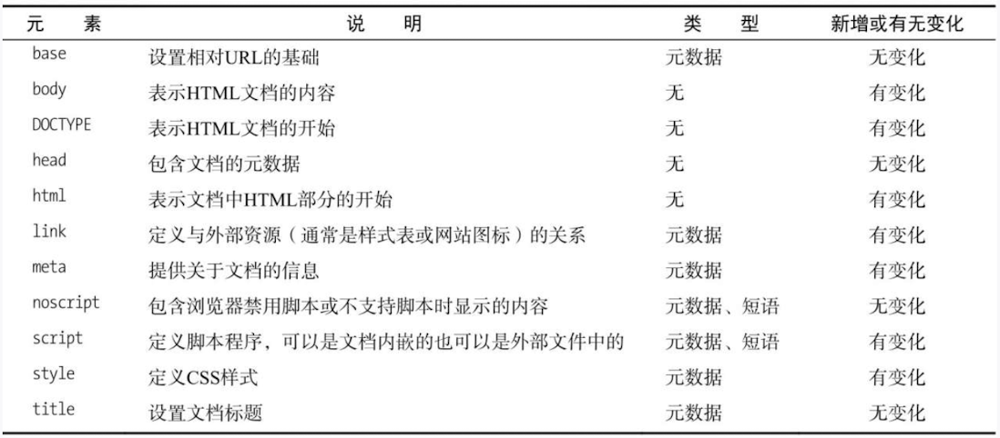
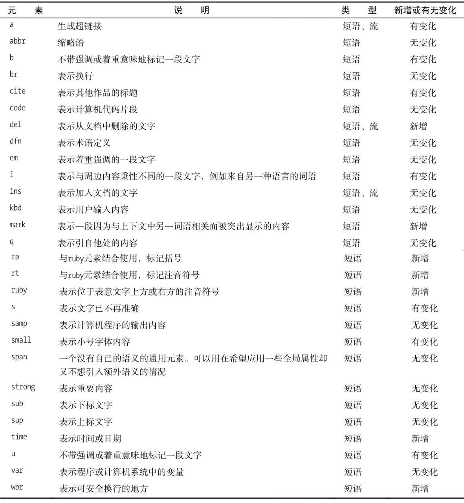
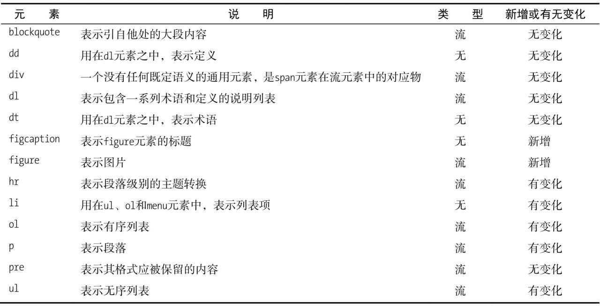
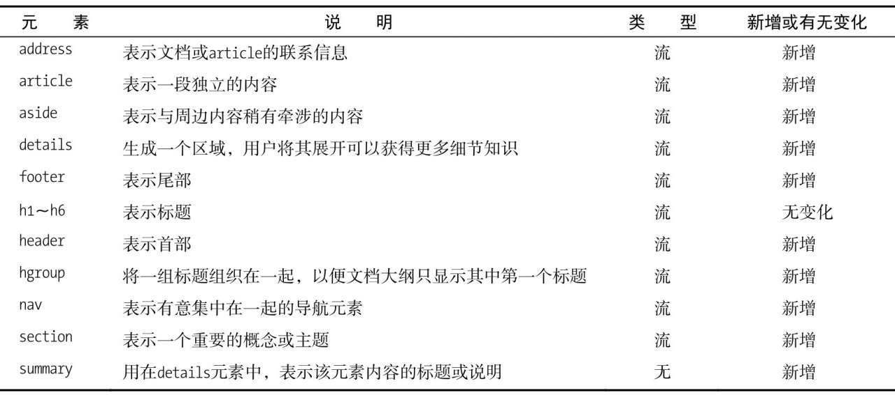
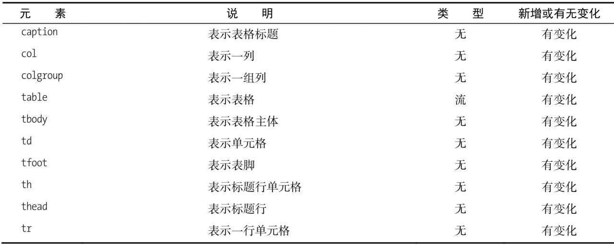
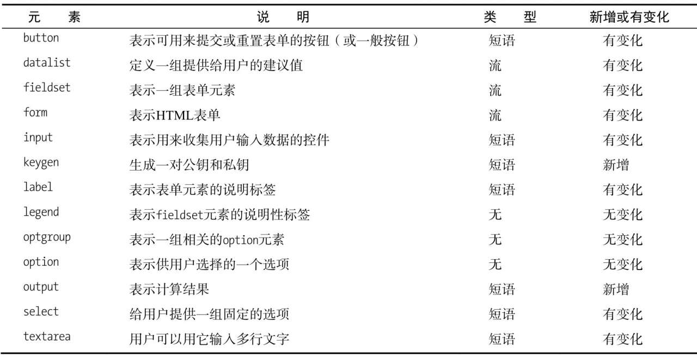
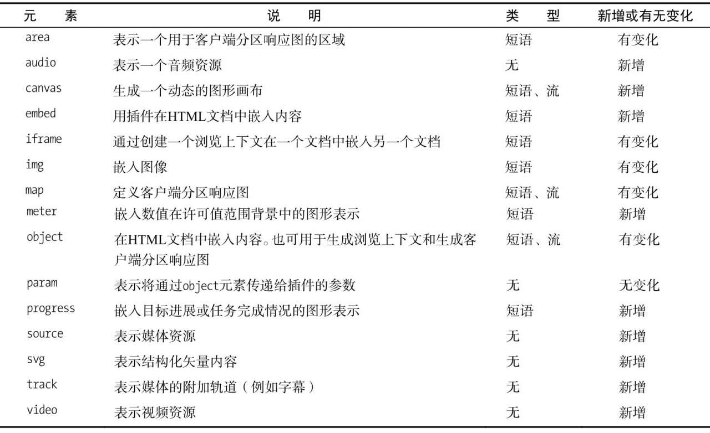

1. HTML5 中的一大主要变化是基本信念方面的：将元素的语义与元素对其内容呈现结果的影响分开。从原理上讲这的确合乎情理。HTML 元素负责文档内容的结构和含义，内容的呈现则由应用于元素上的 CSS 样式控制。HTML 文档的用户未必都需要显示它们，不掺合呈现方面的事有助于简化 HTML 的处理以及从中自动提炼含义。

2. 在选择用来标记内容的元素方面我给读者总结了几条原则

   - 问问自己打算如何发挥一个元素的语义作用，如果不能马上答出就不用这个元素。
   - 对内容进行标记时，只宜将元素用于它们原定的用途，不要创造自有的语义。如果找不到适合自己所要含义的元素，可以考虑使用通用元素（如 span 或 div），并且用全局属性 class 表明其含义。CSS 样式不是类属性唯一的用途。
   - 用来标记内容的元素应该选择最为具体的那个。如果已有元素能恰当表明内容的类型，就不要使用通用元素。
   - 呈现与语义分离原则的目的完全是为了让 HTML 文档更易于程序化处理。

3. 

4. 

5. 

6. 

7. 

8. 

9. 
