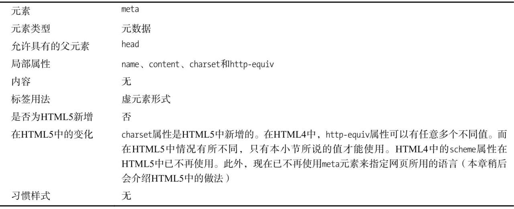

1. base 元素可用来设置一个基准 URL，让 HTML 文档中的相对链接在此基础上进行解析。

```html
<base href="http://www.baidu.com/" />
```

2.  body 的默认样式 带有 margin: 8px

3.  

4.  meta 元素的用法

    > 注意每个 meta 元素只能用于一种用途。如果在这些特性中想要使用的不止一个，那就应该在 head 元素中添加多个 meta 元素。

    - 指定名/值元数据对

      - application name: 当前页所属 Web 应用系统的名称
      - author: 当前页的作者名
      - description: 当前页的说明
      - generator: 用来生成 HTML 的软件名称
      - keywords: 一批以逗号分开的字符串，用来描述页面的内容

    ```html
    <meta name="description" content="A simple example" />
    ```

    - 声明字符编码

    ```html
    <meta charset="utf-8" />
    ```

    - 模拟 HTTP 标头字段
      - http-equiv 属性有三个值可以使用
        1. refresh: 以秒为单位指定一个时间间隔， 在此时间过去之后将从服务器重新载入当前页面。也可以指定一个 URL 让浏览器载入.
        2. default-style: 指定页优先使用的样式表。对应的 content 属性值应与同一文档中某个 style 元素或者 link 元素的 title 属性值相同
        3. content-type: 这是另一种声明 HTML 页面所用字符编码的方法

    ```html
    <meta http-equiv="refresh" content="5;http://www.baidu.com" />
    <meta http-equiv="content-type" content="text/html charset=UTF-8" />
    ```

5.  style 元素可以出现在 HTML 文档中的各个部分。一个文档可包含多个 style 元素，因此不必把所有样式定义都塞进 head 部分。在使用模板引擎生成页面的情况下这个特性很有帮助，因为这样一来就可以用页面特有的样式为模板定义的样式提供补充。

6.  style 可以指定 media， media 属性可用来表明文档在什么情况下应该使用该元素中定义的样式

7.  link 元素的作用

    - 载入样式表
    - 为页面定义网站标志(浏览器默认会请求 favicon.ico)
    - 预先获取资源

8.  script

    - defer: 告诉浏览器要等页面载入和解析完毕之后才能执行脚本
    - async: 浏览器将在继续解析 HTML 文档中其他元素（包括其他 script 元素）的同时异步加载和执行脚本。如果运用得当，这可以大大提高整体加载性能
